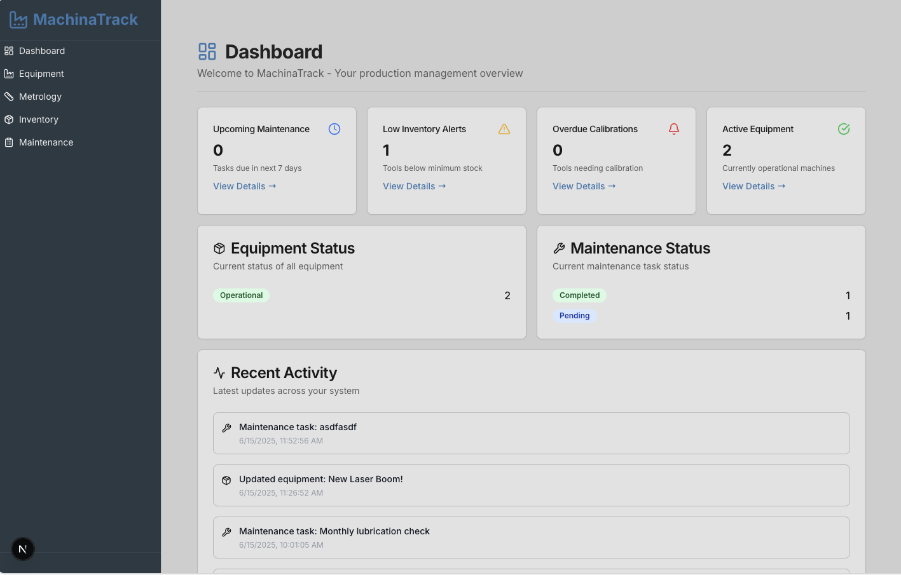

# MachinaTrack

A comprehensive manufacturing and production management system built with Next.js, designed to track equipment, manage inventory, schedule maintenance, and provide predictive analytics for industrial operations.



## 🚀 Features

### 📊 Central Dashboard
- Real-time overview of critical production metrics
- Upcoming maintenance alerts and schedules
- Low inventory warnings and stock alerts
- Equipment status monitoring
- Overdue calibration notifications

### 🔧 Equipment Management
- **Machine Tracking**: Comprehensive tracking of mills, lasers, CNCs, and other equipment
- **Equipment Details**: Model, serial number, location, and operational status
- **Machine Logs**: Historical performance data and error tracking
- **Status Monitoring**: Real-time equipment operational status

### 📏 Metrology Tools
- **Tool Inventory**: Complete inventory of measurement tools (calipers, surface plates, etc.)
- **Calibration Management**: Automated calibration scheduling and tracking
- **Compliance Logging**: Certificate management and audit trails
- **Status Tracking**: Active, expired, and out-of-service tool monitoring

### 🔨 Cutting Tool Inventory
- **Inventory Management**: Track quantities, types, and locations
- **Tool Life Tracking**: Monitor remaining tool life and usage patterns
- **Automated Alerts**: Low stock and end-of-life notifications
- **Cost Management**: Track per-unit costs and supplier information

### 🛠️ Maintenance Scheduling
- **Preventive Maintenance**: Create and manage maintenance schedules
- **Task Management**: Assign and track maintenance tasks
- **Service Records**: Complete history of maintenance activities
- **Parts Management**: Track maintenance parts and inventory

### 🤖 Predictive Analytics
- **AI-Powered Analysis**: Leverage machine learning for predictive maintenance
- **Failure Prediction**: Early warning system for potential equipment failures
- **Pattern Recognition**: Identify trends in machine performance data
- **Cost Optimization**: Reduce downtime through predictive insights

## 🛠️ Tech Stack

- **Framework**: [Next.js 15](https://nextjs.org/) with App Router
- **Language**: [TypeScript](https://www.typescriptlang.org/)
- **Database**: [SQLite](https://www.sqlite.org/) with [Prisma ORM](https://www.prisma.io/)
- **UI Components**: [Radix UI](https://www.radix-ui.com/) with [Tailwind CSS](https://tailwindcss.com/)
- **Charts**: [Recharts](https://recharts.org/)
- **Forms**: [React Hook Form](https://react-hook-form.com/) with [Zod](https://zod.dev/) validation
- **AI Integration**: [Google GenKit](https://firebase.google.com/docs/genkit) for predictive analytics
- **Icons**: [Lucide React](https://lucide.dev/)

## 🚀 Getting Started

### Prerequisites

- Node.js 18 or later
- npm, yarn, or pnpm

### Installation

1. **Clone the repository**
   ```bash
   git clone https://github.com/yourusername/machina-track.git
   cd machina-track
   ```

2. **Install dependencies**
   ```bash
   npm install
   # or
   yarn install
   # or
   pnpm install
   ```

3. **Set up environment variables**
   ```bash
   cp .env.example .env.local
   ```
   
   Edit `.env.local` and configure:
   ```env
   DATABASE_URL="file:./data/machina-track.db"
   GOOGLE_GENAI_API_KEY="your-google-ai-api-key"
   ```

4. **Initialize the database**
   ```bash
   npx prisma generate
   npx prisma db push
   ```

5. **Run the development server**
   ```bash
   npm run dev
   # or
   yarn dev
   # or
   pnpm dev
   ```

6. **Open your browser**
   
   Navigate to [http://localhost:9002](http://localhost:9002) to see the application.

## 📁 Project Structure

```
machina-track/
├── docs/                           # Documentation files
├── data/                           # SQLite database files
├── prisma/                         # Database schema and migrations
├── src/
│   ├── app/                        # Next.js app router pages
│   │   ├── (app)/                  # Protected app routes
│   │   │   ├── dashboard/          # Main dashboard
│   │   │   ├── equipment/          # Equipment management
│   │   │   ├── inventory/          # Tool inventory
│   │   │   ├── maintenance/        # Maintenance scheduling
│   │   │   └── metrology/          # Metrology tools
│   │   └── api/                    # API routes
│   ├── components/                 # React components
│   │   ├── common/                 # Shared components
│   │   └── ui/                     # UI component library
│   ├── lib/                        # Utility functions and types
│   │   └── database/               # Database layer
│   │       └── repositories/       # Repository pattern implementations
│   ├── services/                   # Business logic services
│   └── hooks/                      # Custom React hooks
├── tailwind.config.ts              # Tailwind CSS configuration
├── prisma/schema.prisma            # Database schema
└── package.json                    # Dependencies and scripts
```

## 🎨 Design System

MachinaTrack uses a professional industrial design theme:

- **Primary Color**: Steel Blue (#4682B4) - Professional and robust
- **Background**: Light Gray (#D3D3D3) - Clean and neutral
- **Accent**: Gold (#FFD700) - Highlights important actions and data
- **Typography**: Inter font family for modern readability
- **Icons**: Industrial-style icons representing equipment and tools
- **Layout**: Modular card-based design for effective information organization

## 🔧 Available Scripts

- `npm run dev` - Start development server (port 9002)
- `npm run build` - Build for production
- `npm run start` - Start production server
- `npm run lint` - Run ESLint
- `npm run typecheck` - Run TypeScript type checking
- `npx prisma studio` - Open Prisma database studio
- `npx prisma generate` - Generate Prisma client

## 📊 Database Schema

The application uses a robust SQLite database with the following entities:

- **Equipment** - Manufacturing machines and devices
- **Metrology Tools** - Measurement and calibration instruments
- **Cutting Tools** - Cutting implements inventory
- **Maintenance Tasks** - Scheduled maintenance activities
- **Service Records** - Historical maintenance records
- **Machine Log Entries** - Equipment performance logs
- **Calibration Logs** - Tool calibration history

## 🤝 Contributing

1. Fork the repository
2. Create a feature branch (`git checkout -b feature/amazing-feature`)
3. Commit your changes (`git commit -m 'Add some amazing feature'`)
4. Push to the branch (`git push origin feature/amazing-feature`)
5. Open a Pull Request

## 📄 License

This project is licensed under the MIT License - see the [LICENSE](LICENSE) file for details.

## 🆘 Support

For support, email support@machinatrack.com or join our [Slack channel](https://machinatrack.slack.com).

## 🗺️ Roadmap

- [ ] Mobile app development
- [ ] Advanced AI analytics
- [ ] Integration with IoT sensors
- [ ] Multi-tenant support
- [ ] Advanced reporting and exports
- [ ] Barcode/QR code scanning
- [ ] Integration with ERP systems

---

**MachinaTrack** - Streamlining manufacturing operations through intelligent tracking and predictive analytics.